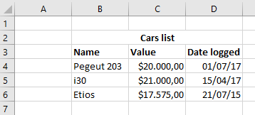
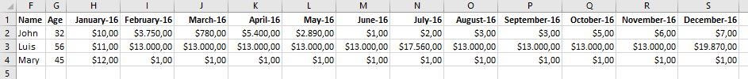

# Summary
This is a simple EPPlus extension that make easier to extract POCO from spreadsheets.

## Installation
You can download the library from nuget with the following command:

´´´
Install-Package EPPlus.DataExtractor
´´´

If you don´t have the EPPlus as a dependency, nuget will install it for you.

## Usage
Using the package is really simple. Let's work with a simple example first.

Consider you want to extract the following data from a spreadsheet:



Just a define a class to hold the data.

```csharp
public class SimpleRowData
{
    public string CarName { get; set; }

    public double Value { get; set; }

    public DateTime CreationDate { get; set; }
}
```

Considering that the data is on a worksheet named **worksheet1**, this is the code that can be used to retrieve an `IEnumerable` of `SimpleRowData`:

```csharp
using (var package = new ExcelPackage("spreadsheet/file/location/file.xlsx"))
{
    var cars = package.Workbook.Worksheets["worksheet1"]
        .Extract<SimpleRowData>()
        // Here we can chain multiple definition for the columns
        .WithProperty(p => p.CarName, "B")
        .WithProperty(p => p.Value, "C")
        .WithProperty(p => p.CreationDate, "D")
        .GetData(4, 6) // To obtain the data we indicate the start and end of the rows.
        // In this case, the rows 4, 5 and 6 will be extracted.
        .ToList();
}
```

Yeah, it is that simple!

### Columns that should be rows
Sometimes the tables defined in spreadsheets does not have a friendly structure for a developer. Instead of creating multiple tables and foreign key relationships in excel it is simpler to put data that should go into different tables as columns in the existing table.
It'll be clear with the following example:



Imagine that you want to extract this data into a class structure where the columns that indicates months/year should be a collection inside the entity that will keep the row data. So we can have two classes defined like that:

```csharp
public class RowDataWithColumnBeingRow
{
    public string Name { get; set; }

    public int Age { get; set; }

    public List<ColumnData> MoneyData { get; set; }
}

public class ColumnData
{
    public double ReceivedMoney { get; set; }

    public DateTime Date { get; set; }
}
```

You can use the following code to extract the spreadsheet data to these classes:

```csharp
using (var package = new ExcelPackage("spreadsheet/file/location/file.xlsx"))
{
    var data = package.Workbook.Worksheets["worksheet1"]
        .Extract<RowDataWithColumnBeingRow>()
        .WithProperty(p => p.Name, "F")
        .WithProperty(p => p.Age, "G")

        // Here, the collection property is defined using the "WithCollectionProperty" method.
        // The following parameter is the expression indicating the property of "ColumnData"
        // that will be used to receive the header data followed by an integer indicating the row
        // that contains the header.
        // The last expression indicates the other "ColumnData" property, this one will receive
        // the row data. The two last strings are the start and end column from where
        // this data will be extracted.
        .WithCollectionProperty(p => p.MoneyData,
            item => item.Date, 1,
            item => item.ReceivedMoney, "H", "S")
        .GetData(2, 4)
        .ToList();
}
```

The `GetData` method returns an `IEnumerable`, and this `IEnumerable` is not evaluated until you interate through it or execute something like `ToList` over it. So make sure you'll do one of those things **before disposing the EPPlus `ExcelPackage`**.