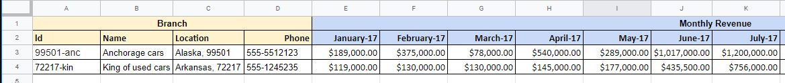

# EPPlus.DataExtractor with EF models
This sample setup a simple EF core database in SQLite and uses the EF model themselves as the DTOs for extracting data from spreadsheet.

## Sample scenario
The sample has 2 model entities, *Branch* and *MonthlyRevenue*, where one branch can have multiple monthly revenues.

The spreadsheet presents the data with one branch per row and the monthly revenues spread across columns



Which is then extracted to the following models:
```csharp
class BranchEntity
{
    public string Id { get; set; } // extracted from spreadsheet (column A)
    public string Name { get; set; }
    public string Location { get; set; }
    public string Phone { get; set; }

    public ICollection<MonthlyRevenueEntity> Revenues { get; set; }
}

class MonthlyRevenueEntity
{
    public Guid Id { get; set; } // automatically generated by EF
    public decimal Value { get; set; }
    public DateTime MonthYear { get; set; }

    // Properties to reference the branch
    public string BranchId { get; set; }
    public BranchEntity Branch { get; set; }
}
```

> This is possible **since version 2.1.0**, which added support to `ICollections` when extracting spreadsheet columns to a collection property in you DTO in a 1 to many relationship.

The sample will extract data from the spreadsheet and insert it into the database. The data from the database is then queried and printed in the console. At the end of the execution the database is cleared out to avoid conflicts with the unique key on subsequent executions.